# Robot Framework Pretty Console

Extension de consola de comandos para [Robot Framework](https://robotframework.org/) diseñada en Python que agrega informacion de la ejecucion de cada bloque de los casos de prueba.


# Descripcion

Es utilizado el concepto [Listener](https://github.com/robotframework/robotframework/blob/master/doc/userguide/src/ExtendingRobotFramework/ListenerInterface.rst) en su version 2, permite extraer la informacion de cada bloque que es ejecutado, ejemplo:

Para cada bloque `Test Case`, `Test Suite`, `Test Suite Directory`, `Test Keyword` existen dos metodos que nos otorgan informacion:
- start: El inicio del bloque con ello nos muestra informacion del bloque (documentacion, linea en archivo, nombre, nombre largo, ruta, tiempo inicio, tiempo final, libreria, etc)
- end: El final del bloque con ello nos muestra informacion del bloque (documentacion, linea en archivo, nombre, nombre largo, ruta, tiempo inicio, tiempo final, libreria, estatus, etc)

Por otra parte, hay bloques que solo contienen un metodo, por ejemplo: `Library Import`, `Resource Import`, `Variables Import`, `Log Message`, etc.


# Consideraciones 

Casos de prueba diseñados con la version de [Robot Framework](https://robotframework.org/) - [6.0.1](https://github.com/robotframework/robotframework/milestone/66?closed=1).

Version de [Python](https://github.com/robotframework/robotframework/milestone/66?closed=1) - [3.9.0](https://www.python.org/downloads/release/python-390/).


# Requerimientos

## Aplicaciones
- Python

## Python Extensiones
- robotframework
- colorama


# Comandos

Nota: Esta extension no modifica ningun valor en la ejecucion de los casos de prueba, el fin de esta extension es mostrar informacion de la ejecucion en la consola de comandos.

Se recomienda ejecutar con la consola de comandos en pantalla completa.

# Ejecucion sin color

```probot```
```prettyrobot```
```pretty_robot```
```pr```

Dado el siguiente caso de prueba:

``` robotframework
# filename: main.robot
*** Settings ***

Documentation
...    Test from robotframework-pretty_console extension

Test Tags
...    demo

Metadata    python    3.9.0
Metadata    robot    6.0.1


*** Keywords ***

Realizar Operacion
    [Documentation]
    ...    valida el resultado de una expresion
    
    [Tags]
    ...    operaciones

    [Timeout]    5 seconds

    [Arguments]    ${expresion}
    
    ${resultado}=    Evaluate    ${expresion}    

    RETURN    ${resultado}

    [Teardown]    Log To Console    El resultado es: ${resultado}

 
*** Test Cases ***

Caso de prueba
    [Documentation]
    ...    prueba de extension
    
    [Tags]
    ...    extension_python

    [Setup]    Log To Console    Iniciando mi flujo

    [Template]    Realizar Operacion

    5 * 10
    20 + 20
    10 - 5

    [Teardown]    Log To Console    Terminando mi flujo
```

Podemos utilizar los comandos antes mencionados para darle estructura:
```probot main.robot```

El resultado que obtendriamos seria el siguiente:

En primera instancia validamos los vinculos (imports) que hayamos agregado (si fueron agregados argumentos al instanciar nuestras librerias, se veran en este apartado):
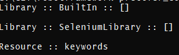

Posteriomente podemos observar la informacion del `Test Suite`:
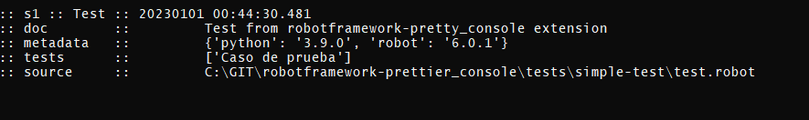
Nota: Considere que, esta imagen representa la salida en consola habiendo ejecutado un archivo. Si usted ejecuta por carpeta, la informacion del bloque puede cambiar.

Tambien podremos observar la informacion del bloque `Test Case`:
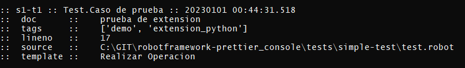

Los apartados de `Test Keyword` se podran ver de la siguiente forma:
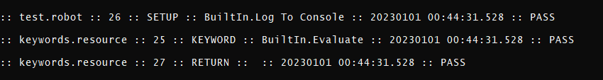

Si la Keyword es "BuiltIn.Log To Console" podremos ver un bloque distintivo:
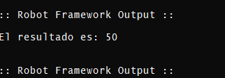


El resultado final es:
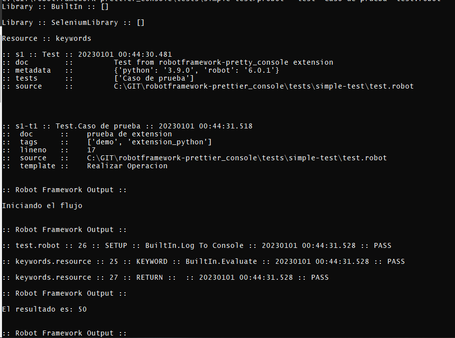
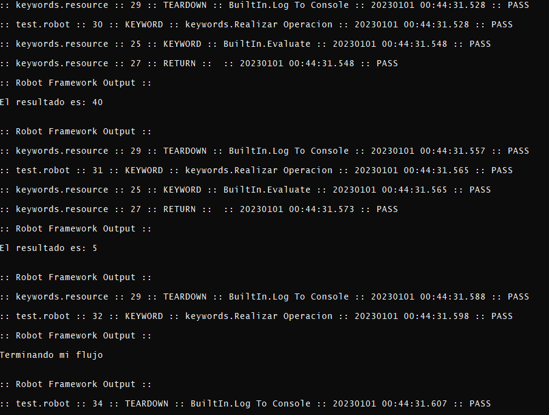
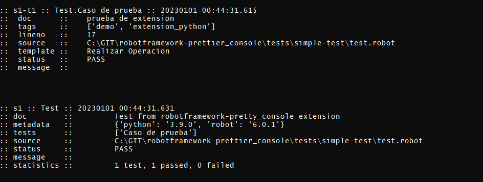

# Ejecucion con color

```cprobot```
```colorprettyrobot```
```color_pretty_robot```
```cpr```

Dado el mismo ejemplo que en el caso de prueba sin color pero utilizando el comando: ```cprobot```

Obtendriamos la siguiente salida de consola:

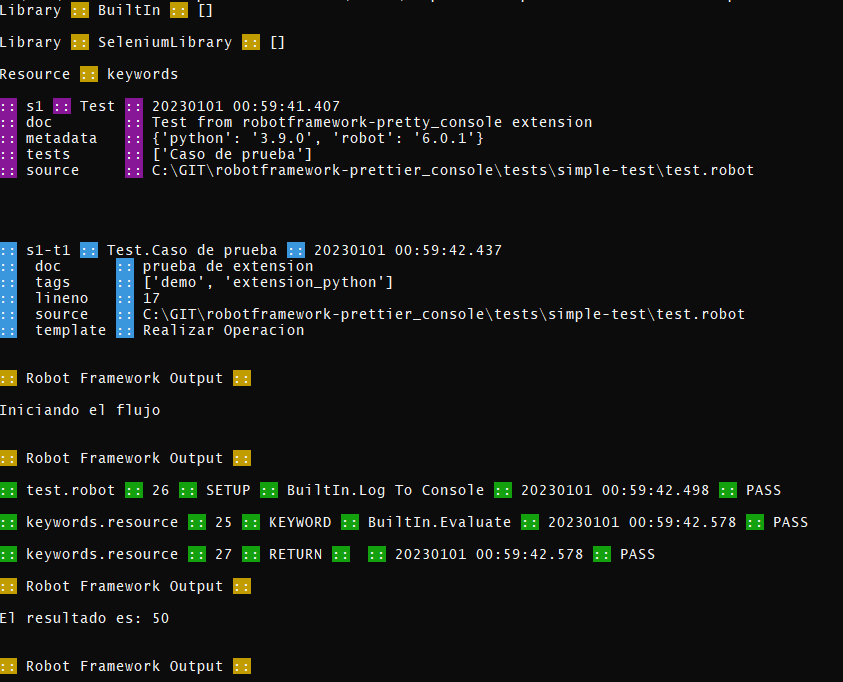
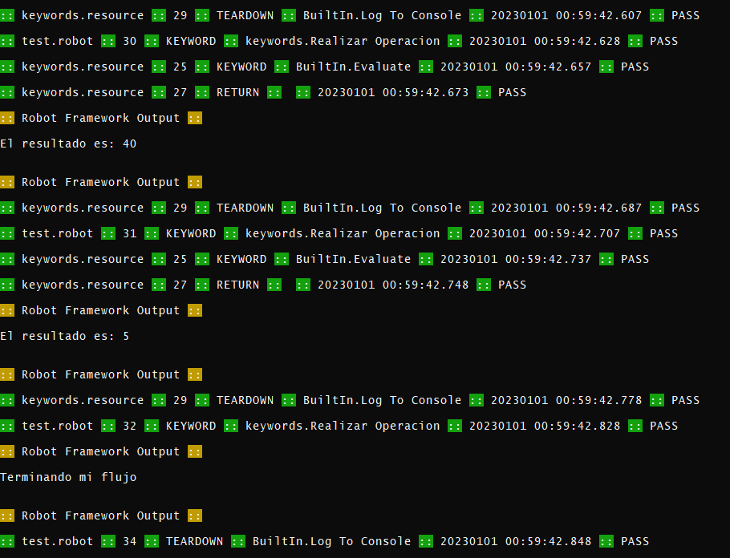
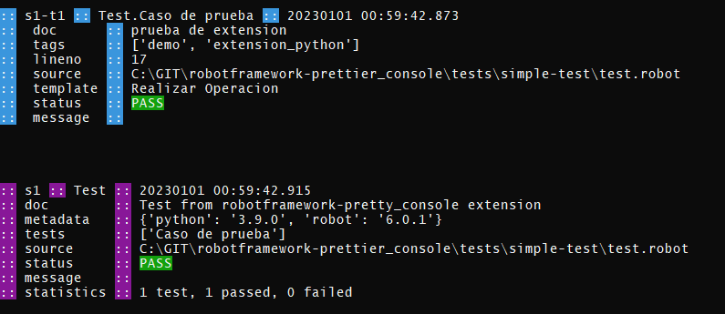

Los imports y los mensajes entre el output de la keword `Log To Console` tienen color amarillo.

Las `Test Keywords` tiene 2 colores, verde si el estatus es "Pass" o rojo si es "Fail" (Las keywords con estatus "Not run" son omitidas), el bloque `Test Case` tiene color Cyan, el bloque `Test Suite` tiene color magenta y el bloque `Test Suite Directory` tiene color azul.
